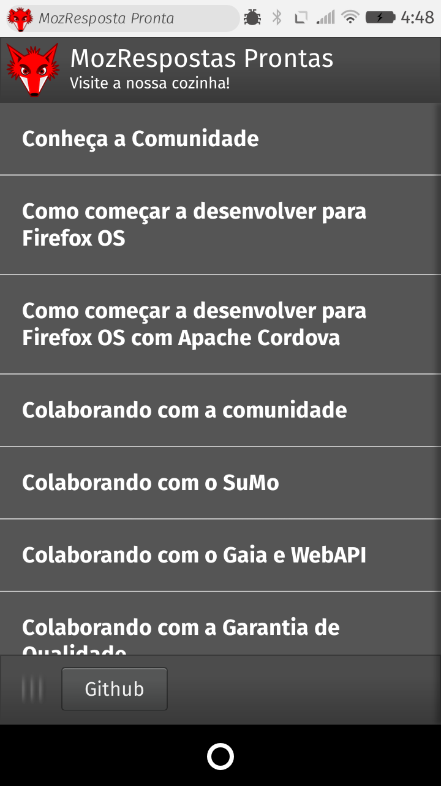
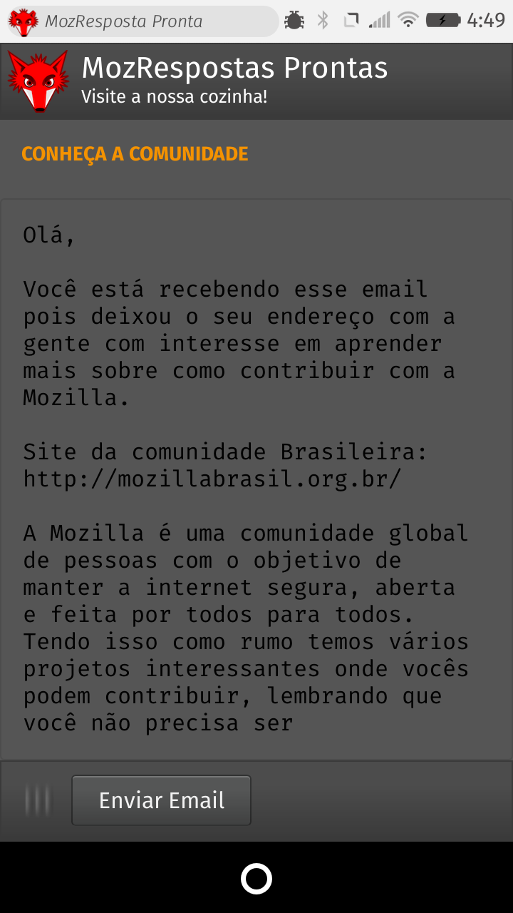

## MozRespostas Prontas

Apenas uma coleção de respostas prontas para utilizar nos emails da [Mozilla Brasil](http://mozillabrasil.org.br). Muito útil quando estamos em um evento ou conversando com alguém.

## Para utilizar o app

O app está disponível em [http://soapdog.github.io/mozbr-templates/](http://soapdog.github.io/mozbr-templates/) ou pode ser instalado em um aparelho com Firefox OS ou WebRT. A versão final está dentro da pasta `deploy`.

## Contribuindo

forke o repositório. Adicione sua template na pasta /assets/templates e modifique o arquivo /assets/templates.json e mande um pull request.

## Screenshots

## Tela principal
Nessa tela você pode escolher qual das respostas prontas deseja utilizar

## Tela de conteúdo
Nesta tela você vê o conteúdo da resposta pronta e com um clique envia um email.

